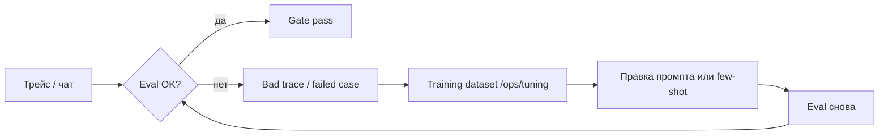

# Карта обучения агентов (2026-06-12)

> **«Обучение» в SmartCRM** — не fine-tune модели на GPU, а **улучшение поведения**: промпт, few-shot, датасет пар, RAG, eval-цикл.  
> Канон gate: [`AGENTS_QUALITY_GATE_ACCEPTANCE.md`](AGENTS_QUALITY_GATE_ACCEPTANCE.md).

---

## Цикл (главное)

| Шаг | Где в продукте | Что меняется |
|-----|----------------|--------------|
| 1. Ошибка видна | `/ops/traces`, `/ops/intents/eval`, gate JSON | Фиксируем кейс |
| 2. В датасет | `/ops/tuning` — training datasets, import bad traces | Пары input → эталон JSON |
| 3. Улучшение | `/ops/intents/improve`, override промптов | Текст инструкций агента |
| 4. Проверка | `run_agents_quality_gate.py`, `/ops/intents/eval` | Pass rate % |
| 5. Gate | Acceptance-таблица | `[x]` в MAP только при зелёных цифрах |

---

## Агент × откуда учится × куда кладём знания

| Агент | Роль | Откуда берёт знания | Как «учим» (меняем) | Eval / gate |
|-------|------|---------------------|---------------------|-------------|
| **Hermes** | NLU: intent + slots | `eval/cases.jsonl`, training datasets, bad traces | `hermes_system_prompt.txt`, few-shot в `/ops/intents/improve`, `core/hermes/rescue.py` (CPU) | Intent pass rate ≥85% / 30 кейсов · Ollama `hermes3` |
| **Analyst** | CRM, лиды, анализ | Промпт `agents/analyst/`, RAG | `agent_prompt_analyst.txt`, RAG PDF, training pairs | Ответ содержит ключевые факты ≥75% / 15 |
| **Economist** | Финансы, ROI, LTV | Промпт + RAG (PDF) | `agent_prompt_economist.txt`, RAG | ≥75% / 15 |
| **Marketer** | Позиционирование, письма | Промпт + RAG | `agent_prompt_marketer.txt`, RAG | ≥75% / 15 |
| **Tech** | Стек, интеграции | Промпт + RAG | `agent_prompt_tech_specialist.txt`, RAG | ≥75% / 15 |
| **Strategist** | Сводка, рекомендация | Промпт + выходы других агентов | `agent_prompt_strategist.txt` | ≥75% / 15 |

**Файлы override:** `backend/data/hermes_system_prompt.txt`, `backend/data/agent_prompt_{id}.txt` — API `/api/ops/agents/{id}/prompt`.

**Датасеты:** БД `training_datasets` / `training_records` — импорт CSV/JSONL/PDF, `import-bad-traces` из трейсов.

---

## LLM для eval (решение 2026-06-12)

| Зона | Модель | Примечание |
|------|--------|------------|
| Hermes eval | **Ollama** `HERMES_MODEL` (default `hermes3:latest`) | Groq нет; `EVAL_OLLAMA_TIMEOUT` при медленном железе |
| Агенты 5× | Тот же стек, что в `core/llm.py` | На прогоне gate — **Ollama** если Groq не задан |

Запуск Ollama на ноуте обязателен перед live gate: `ollama serve`, `ollama pull hermes3`.

---

## UI (обучение + eval)

| Страница | Зачем |
|----------|--------|
| `/ops/intents/eval` | Прогон кейсов, фильтр по агенту (шаг 2+) |
| `/ops/intents/improve` | Few-shot / улучшение Hermes |
| `/ops/tuning` | Датасеты, import bad traces, export |
| `/ops/traces` | Сырые диалоги → источник для датасета |
| `/ops/insights` | Подсказки: что чинить после провалов (шаг 5+) |

---

## Следующие шаги (не этот коммит)

1. Eval-кейсы ≥N на каждого из 6 агентов  
2. `run_agents_quality_gate.py` + JSON в `backend/data/artifacts/eval/`  
3. Live-прогон Ollama → зелёная acceptance-таблица → `[x]` в PRD_MAP
