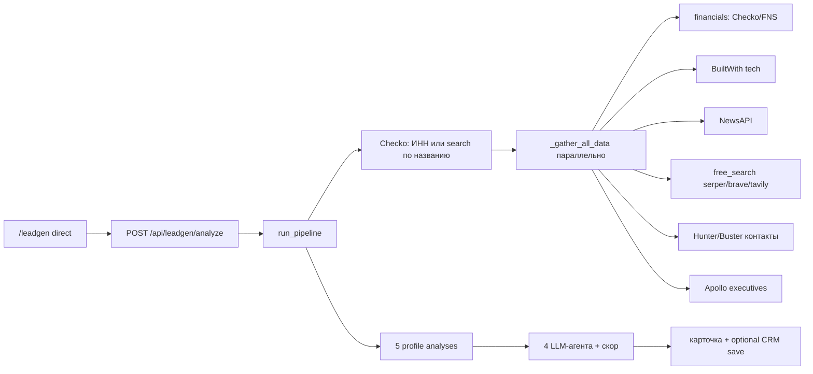

# Смоук лидогена — анализ по ИНН / названию (2026-06-08)

PRD_MAP: **«Лидогенерация `/leadgen`» — Анализ по ИНН / названию** (перепроход)

## Команда

```bash
cd backend && python scripts/smoke_leadgen_inn_analysis.py
```

79+ pytest + live Checko по названию + live `run_pipeline(inn=7707083893)` + probe `/leadgen`.

---

## Пайплайн (как генерируется карточка)



---

## Было → стало

| Было | Стало |
|------|--------|
| Только unit/integration моки в `test_leadgen.py` | **+4 API-теста** `test_leadgen_analyze_api.py` |
| Нет live smoke / DevTools | `smoke_leadgen_inn_analysis.py` + DevTools E2E |
| Нет testid на форме direct | `leadgen-direct-inn`, `leadgen-analyze-btn`, `leadgen-result-*` |
| Checko отдавал `https://site.ru` → ссылки `https://https//...` | **normalize website** в pipeline + `websiteHref()` в UI |
| `fetch_full_profile`: `NameError _available` | import `_available` в `checko/endpoints.py` |

---

## ✅ СДЕЛАНО и ПРОВЕРЕНО (DevTools 2026-06-08)

| # | Шаг | Результат |
|---|-----|-----------|
| 1 | ИНН `7707083893` (Сбербанк) | Карточка ~99 с: ИНН, Греф, скор **74**, Hunter 10 email |
| 2 | Checko ЕГРЮЛ | Название, ОГРН, адрес, ОКВЭД, 36 дочерних |
| 3 | Контакты | Телефоны Checko + Hunter domain search |
| 4 | Агенты | analyst/tech/marketer/strateg — оценки + скрипт захода |
| 5 | UI loading | «Анализирую…» → карточка без ошибки API |
| 6 | Название «Яндекс» (без ИНН) | Checko → МКПАО ИНН `3900019850`, скор **71**, финансы 88 млрд, ~58 с |
| 7 | Ссылки сайта после fix | `https://sro-spi.ru/` — без двойного `https://` |

**testid:** `leadgen-direct-inn`, `leadgen-direct-name`, `leadgen-analyze-btn`, `leadgen-result-card`, `leadgen-result-score`, `leadgen-result-inn`

---

## ⚠️ НЕ СДАНО / известные пробелы

| Пробел | Влияние | Примечание |
|--------|---------|------------|
| Выручка «—» у крупных банков | финансы | Checko/FNS без полного ключа или закрытая отчётность |
| BuiltWith 0 tech на sberbank.ru | tech stack | WAF / блок сканера |
| ~**90–120 с** на полный анализ | UX | `deep_analysis=False` в smoke; Ф2 — кэш |
| Поиск по короткому названию «Яндекс» | качество | Checko `count=1` → **не тот** юрлицо (МКПАО Калининград, сайт sro-spi.ru); нужен ИНН или уточнение |

---

## Следующий пункт MAP

**«Поиск по портрету»** — отдельный перепроход (режим `portrait`).
